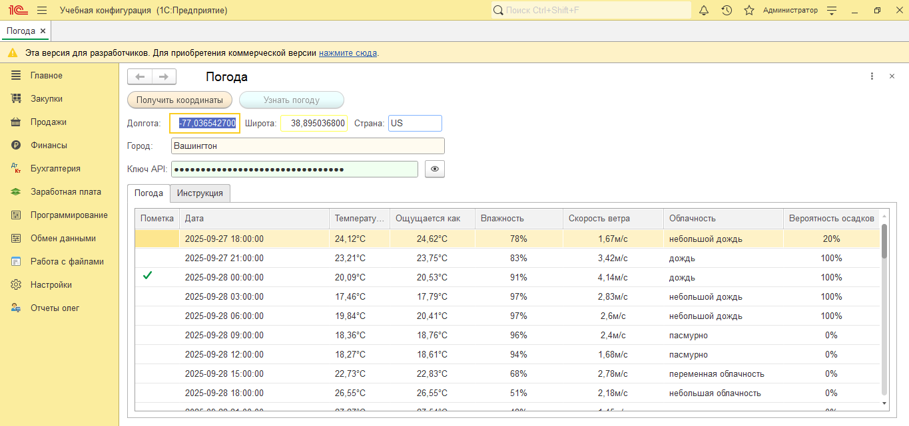

# 1c-weather-forecast
Weather forecast integration for 1C:Enterprise - OpenWeatherMap API connector
[](https://1c.ru)
[](LICENSE)

Обработка для 1С:Предприятие, предоставляющая прогноз погоды через интеграцию с OpenWeatherMap API.

 Функциональность

**Определение координат** города через Geo API
**Прогноз погоды** на 5 дней с интервалом 3 часа
**Детальная информация**: температура, влажность, скорость ветра, облачность
**Русскоязычный интерфейс**
**Безопасное хранение** API ключа



 старт

### 1. Получение API ключа
1. Зарегистрируйтесь на [OpenWeatherMap](https://home.openweathermap.org/users/sign_up)
2. Получите API ключ в [личном кабинете](https://home.openweathermap.org/api_keys)

### 2. Установка
1. Скачайте файл `Погода.epf`
2. В 1С:Предприятие: **Файл → Открыть** → выберите файл обработки

### 3. Использование
1. Введите API ключ в поле **"Ключ API"**
2. Введите название города
3. Нажмите **"Получить координаты"**
4. Нажмите **"Узнать погоду"**


##  Технические детали

- **Платформа 1С:** 8.3.10 и выше
- **API:** OpenWeatherMap Geo & Forecast APIs
- **Кодировка:** UTF-8
- **Безопасность:** HTTPS соединение

##  Структура проекта

```
1c-weather-openweathermap/
Погода.epf          # Основная обработка
README.md           # Этот файл
LICENSE             # Лицензия
images/             # Скриншоты (добавить позже)


  Разработка

Для доработки обработки:
1. Откройте в **Конфигураторе 1С**
2. Внесите необходимые изменения
3. Сохраните как внешнюю обработку

## 📄 Лицензия

Этот проект распространяется под лицензией MIT. Подробнее см. в файле [LICENSE](LICENSE).

## 👨‍💻 Автор

[ol-2025] - [https://github.com/ol-2025]

---

⭐ Если этот проект был полезен, поставьте звезду на GitHub!
